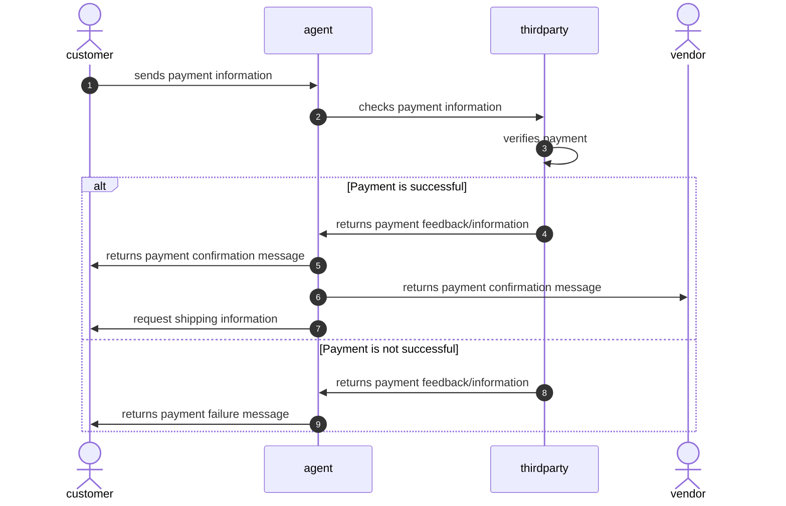

# autobiz
Automating business processes using AI

### Prerequisites

- Ensure you have Docker and Docker Compose installed on your machine.
- You have a .env file configured with necessary environment variables.

### Usage

Step 1: Building and Running the Application
To build and run the application, use the following command:

`docker-compose -f docker/dev/docker-compose.yml --env-file .env up --build`

This command will:

- Build the Docker images specified in the docker-compose.yml file.
- Start the containers defined in the docker-compose.yml file.
- Use the environment variables specified in the .env file.

Step 2: Interacting with the Web Instance
To execute Python code within the running web instance, use the following command:

`docker exec -it dev-web-1 python path/to/file`

Replace path/to/file with the path to the Python script you want to run.

Step 3: Interacting with the Database
To access the database shell within the running database container, use the following command:

`docker exec -it dev-db-1 /bin/bash`

This command will open a bash shell inside the database container, allowing you to interact with the PostgreSQL database directly.

*Additional Notes* 
> Ensure the names of the services (dev-web-1 and dev-db-1) match the names defined in your docker-compose.yml file. Adjust the commands accordingly if the names differ.

> The commands provided assume that your Docker containers are named according to the service names defined in the docker-compose.yml file. If your container names are different, you will need to replace dev-web-1 and dev-db-1 with the actual names of your containers.

## Flow Diagram

```mermaid
sequenceDiagram
    autonumber
    actor customer
    participant agent
    actor vendor
    customer->>agent: makes product request
    agent->>agent: checks product availability
    note over agent: database/inventory is a tool in agent
    alt Product is available
      agent->>customer: returns product availability feedback/information
    else Product is not available
      agent-->>vendor: verifies product is not available
      vendor-->>agent: confirms product availability
      agent->>customer: returns product availability feedback/information
    end
```

<h3>1. Customer chat and support</h3>

<h3>2. Order process and handling (including payment options)</h3>

<h3>3. Post order logistic handling</h3>
<h3>4. Inventory management</h3>
<h3>5. Product recommendation/advertisement</h3>
<h3>6. Business data analysis and insight</h3>
<h3>7. Product review</h3>
<h3>8. Customer feedback</h3>