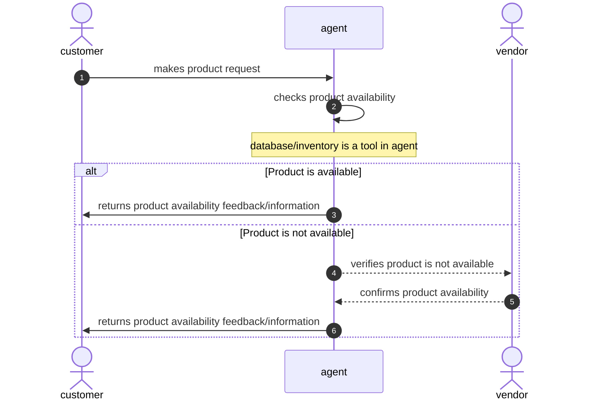
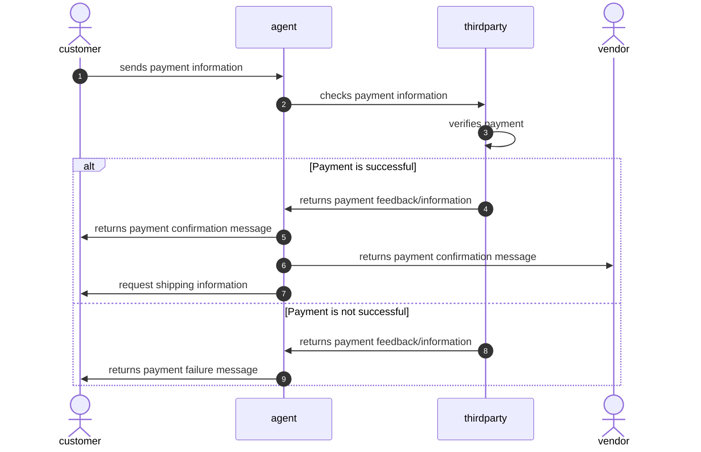

# autobiz
Automating business processes using AI

<h3>1. Customer chat and support</h3>

```mermaid
sequenceDiagram
    autonumber
    actor customer
    participant agent
    actor vendor
    customer->>agent: makes product request
    agent->>agent: checks product availability
    note over agent: database/inventory is a tool in agent
    alt Product is available
      agent->>customer: returns product availability feedback/information
    else Product is not available
      agent-->>vendor: verifies product is not available
      vendor-->>agent: confirms product availability
      agent->>customer: returns product availability feedback/information
    end
```

<h3>2. Order process and handling (including payment options)</h3>

```mermaid
sequenceDiagram
    autonumber
    actor customer
    participant agent
    participant thirdparty
    actor vendor
    customer->>agent: sends payment information
    agent->>thirdparty: checks payment information
    thirdparty->>thirdparty: verifies payment
    alt Payment is successful
      thirdparty->>agent: returns payment feedback/information
      agent->>customer: returns payment confirmation message
      agent->>vendor: returns payment confirmation message
      agent->>customer: request shipping information
    else Payment is not successful
      thirdparty->>agent: returns payment feedback/information
      agent->>customer: returns payment failure message
    end
```

